---
title: "2011 Campaign Contributions"
author: "Felix Olazaran, Jinho Kim, Hans Urquia"
date: "12-04-2014"
output: html_document
---

We analized a dataset provided by Enigma app, which consists of 2.2 million entries on contributions made by individuals and companies to U.S federal election campaigns in 2012.
Enigma provides a very interactive interface in which you can filter data, make specific subsets of the data, visualize totals on specific attributes and some other useful analysis tools.
Signing up to their website is free and required to gain access to the data.

https://app.enigma.io/table/us.gov.fec.summary.2012?row=0&col=31&page=1

Some of the most relevant columns about this dataset include ContributionAmount, ContributorState, RecipientState, RecipientParty, ContributorGender, ContributorOcupation, ContributorEmployer, etc. Overall this dataset was very rich and provided data that was useful and interesting for analysing.

##Findings & Analysis

###Data Mining

As this was a very extense dataset to dive into, we decided to begin analyzing a subset of it and see if we could find something interesting, so we looked into contributions made specifically by students. To achieve this, we made a few arrangements in our Oracle Data Miner workflow.

####SQL Query
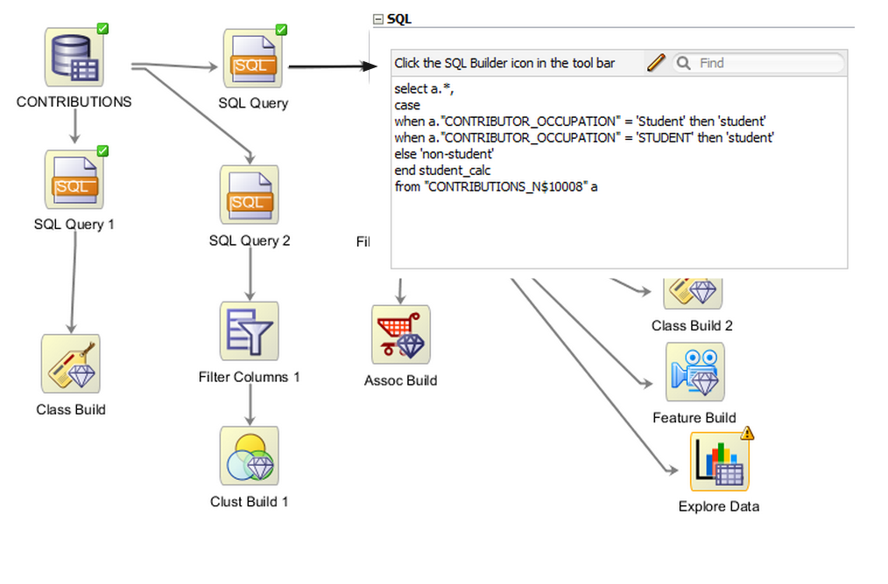
By executing this query we classified contributors as either "student" or "non-student".

The dataset contains contributions not only to the Democrat and Republican parties, but also to Independent, 3rd Party, and a few others that we did not consider very relevant; we wanted to focus on Democrat and Republican contributions so we executed another query to achieve this.
Additionally, the dataset categorized contributions made by individuals ('M' male, 'F' female) and companies.
So we queried for entries classified as 'M' and 'F', as we wanted to focus on individuals who where classified as 'student'.

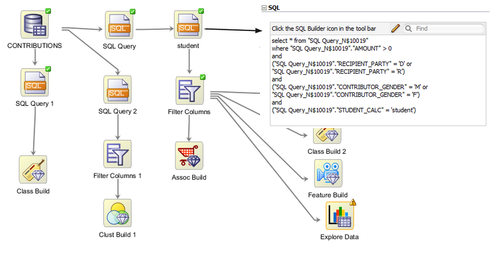

####Column Filtering
Now that we queried for the data we desired, we proceeded to filter the columns in a way that would help our purposes when running running the clustering algorithms on the data

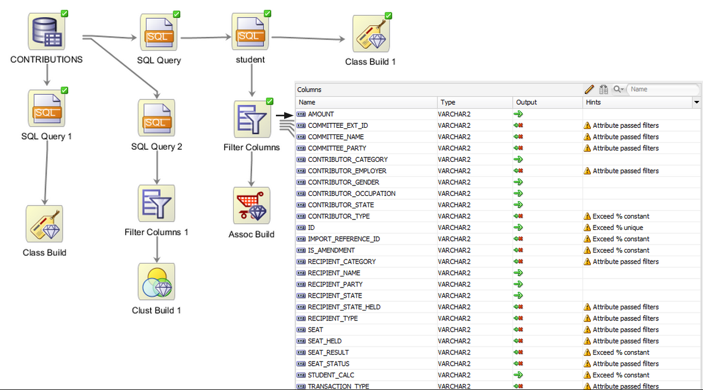

####Clustering
We went on to run the cluster build on our data source
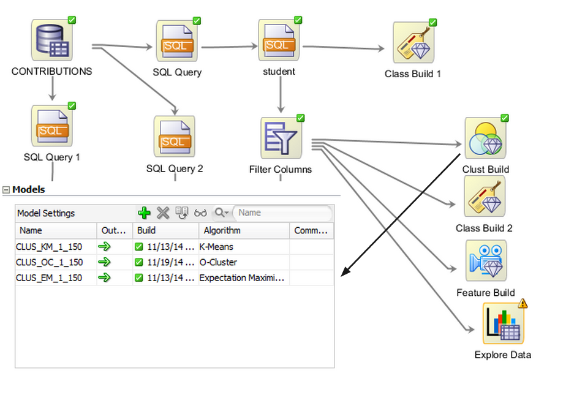

**O-Cluster**
We looked specifically at the O-Cluster algorithm generated, and to our surprise we found something that would lead the rest of our research in this dataset.

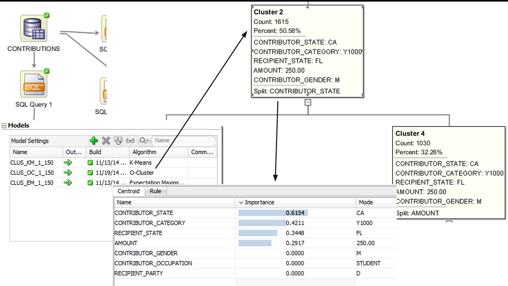

When looking at the clusters generated by the algorithm, we found out that a significant subset of the students specifically in California were making their contributions to outer state (making contributions to states other than California), as shown on Cluster 2 of the figure above.
This finding was interesting enough that we decided to focus our analysis on student contributions in California and how outer state contributions looked overall.

###Tableau

####Cali Students
We wanted to further analyze the contributions made by students in california, so we created this graph

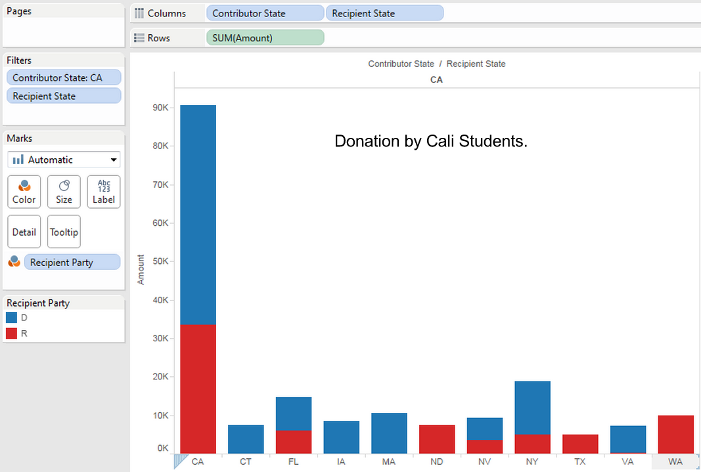

As the clustering algorithm told us, a big part of the donations made by students in CA are going to outside of the state. Students know CA is a solid blue state, and hence decide to use their money in a smarter way by contributing to disputed states.
This may lead to the belief that this is a common trend amongst the general population, so we went on to analyze contributions made specifically by retired people in California.

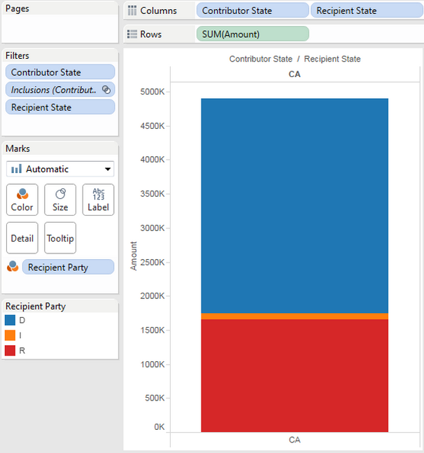

Surprisingly, we found that retired people in California did not record a single outer state contribution!

####Overall Students
Moving on, we wanted to analyse this phenomenon for students all over the country, so we created the following calculated field

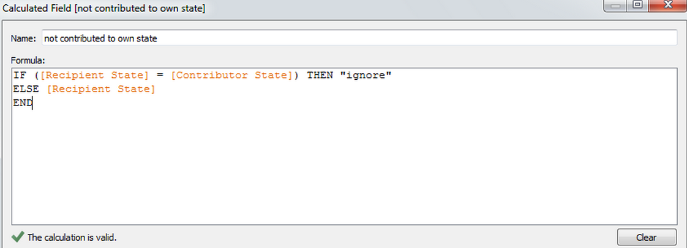

By utilizing this calculated field we generated this graph.

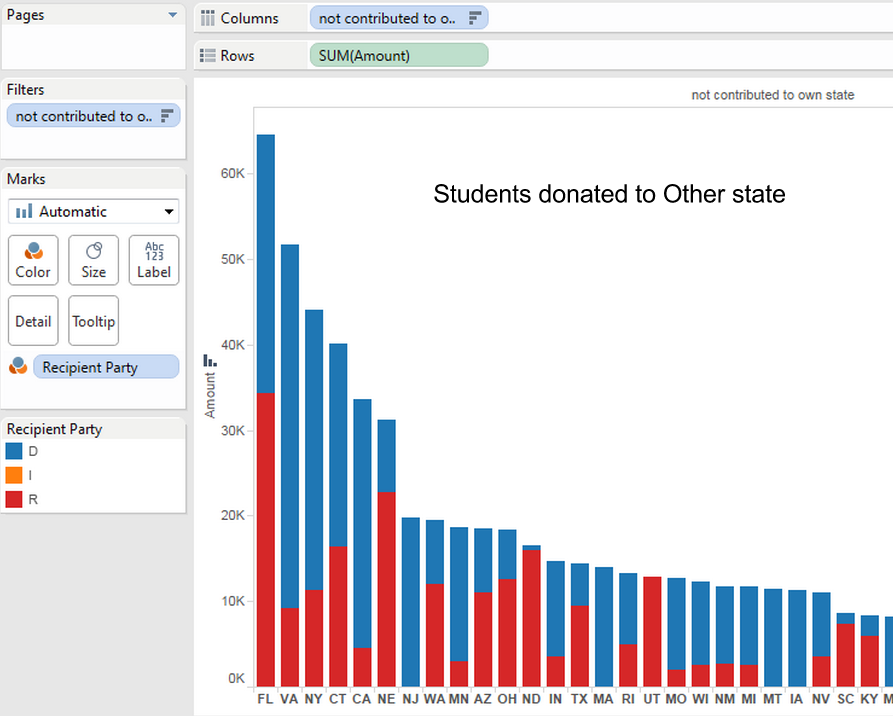

It came to our attention that swing states were recieving a lot of outer state student attention, having FL, VA, NE, NJ, OH in the top part of the graph.

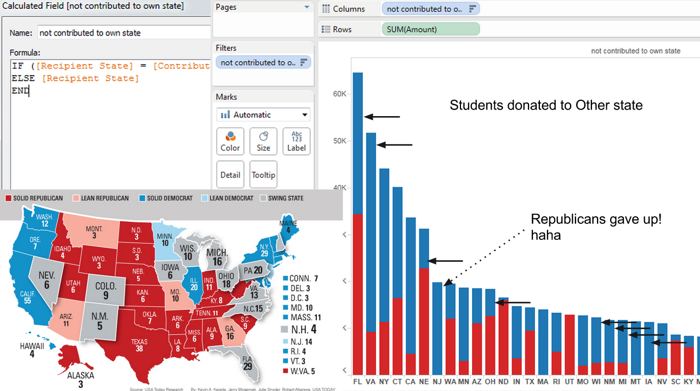

But what about NY, CT and CA? These states are inside the top 5 and are NOT swing states; after a bit of thinking and research, we realized that these 3 states are amongst the richest in the country, according to State Income Tax Collections per capita, as shown in the figure below; this lead us to the most reasonable conclusion that wealthy family students from these states who reside in other states are contributing back to their home state.

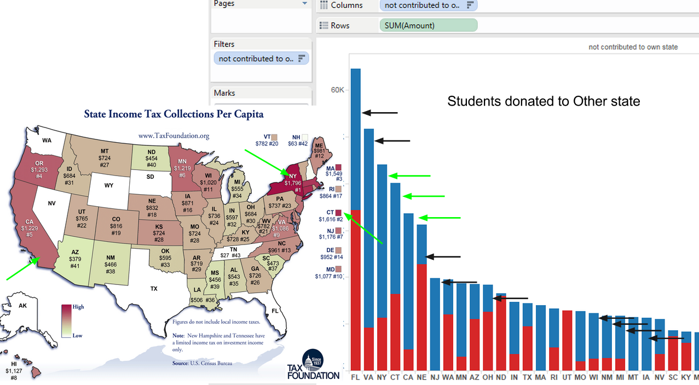

####Overall Retirees
Additionally, we went on to do the same kind of analysis for retirees all over the country.
We generated the following graph.

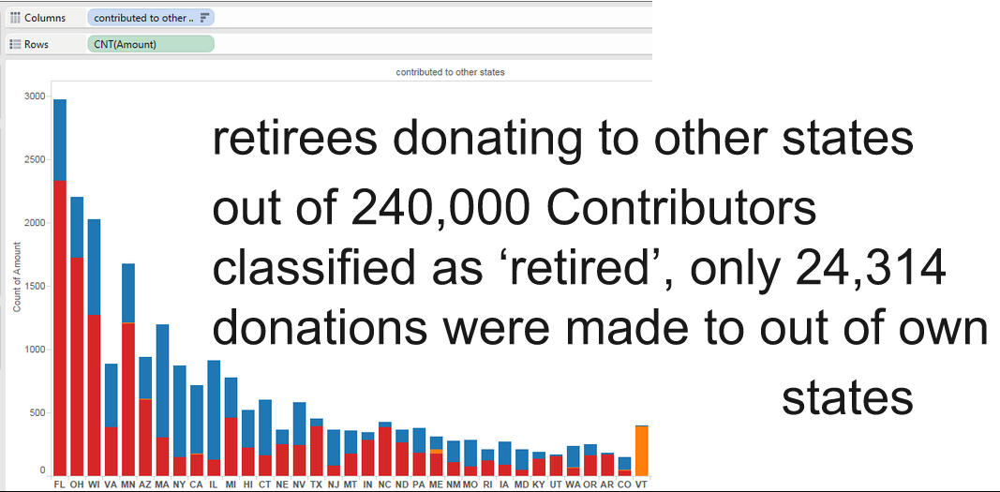

As explained in the figure, we noted that only about 10% of total contributions made by contributors classified as retirees went an outer state.

####Anomalous Students
Finally, we found a couple of interesting anomalies amongst our student contributions subset.

**John Ramsey**, a student from Austin, Texas, recorded $1.91 million dollars in political campaign contributions.
Upon some [brief research](http://www.thedailybeast.com/articles/2012/10/03/21-year-old-millionaire-buys-his-way-to-political-influence.html), we found that the 21 year-old started a super PAC, Liberty For All (LFA), which claims to have helped in deciding two Republican primary wins.

**Matthew W. Goldman** was found to be the highest Democrat student-contributor with $142,400.
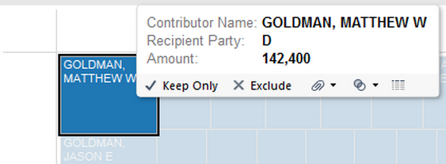

